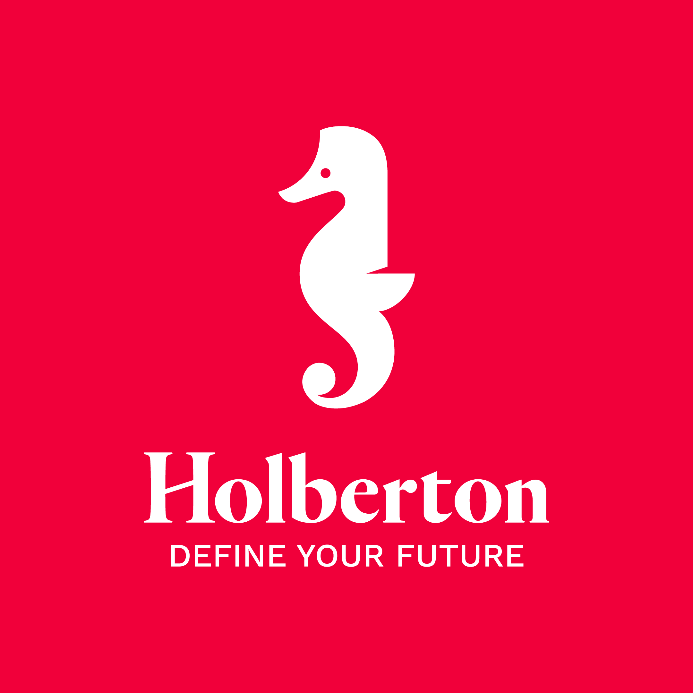

           

# Holberton Task - holbertonschool-web-development- css_advanced

# My Amazing HTML Project

Welcome to my amazing HTML project! This project includes advanced HTML files and demonstrates my skills in creating modern and interactive web pages.

## Table of Contents

If your README is long, add a table of contents to make it easy for users to find what they need.

- [Installation](#installation)
- [Credits](#credits)
- [License](#license)

## Installation

Follow these steps to run the project on your local machine:

1. **Get repository link for download project**: You can find out how to get the repo link from the screenshot below.

2. **Download the Project Repository**: Clone or download the entire project repository to your computer. Type the git command in the screenshot into the terminal on your computer

3. **Choose an IDE**: Download and install any IDE that can run `.html` files. For example, you can use Visual Studio Code, Sublime Text, or simply Notepad. You can do this with any of the following:

4. **View the Design**: Once you have the project files on your computer, open the main `.html` file in your chosen IDE. Then, run the project in any web browser of your choice to view the design.

## Credits

I don't have any member yet for collaborate this project you. If you have any member please add their github username for collaborate this project 

## License
I have not yet any licence for current project but when i get new licence i will add here

🏆 

## Badges
Not yet 

## Features

My project is simple for now when i begin add new features i will add description for theirs in this section
